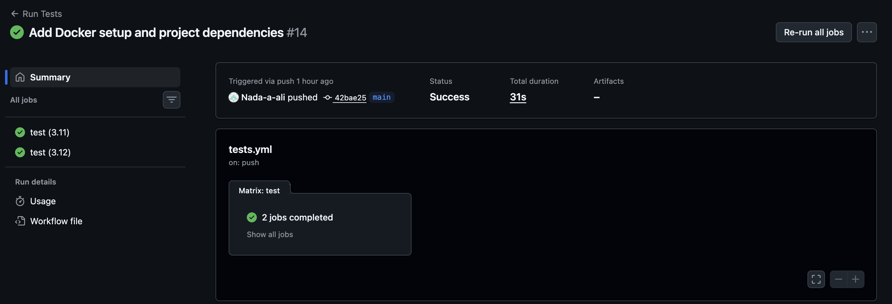
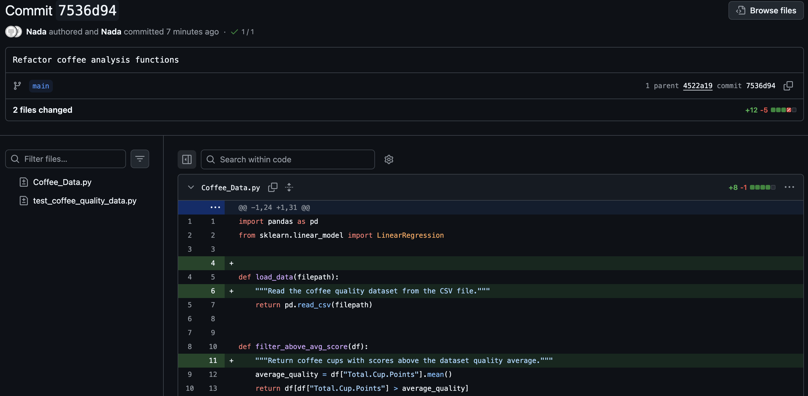
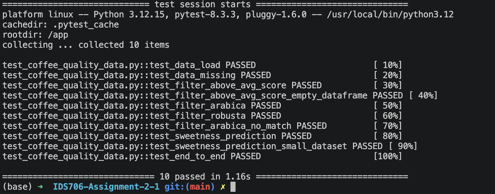

# Coffee Quality Data Analysis

In this project, a coffee quality dataset was imported from Kaggle, based on the Coffee Quality Database <https://github.com/jldbc/coffee-quality-database.git> for exploratory analysis and machine-learning experimentation. This dataset contains information from reviewers for Arabica and Robusta coffee bean types. 

The imported dataset includes quality measures (e.g., flavor, aftertaste, sweetness) as well as farm metadata (e.g., country of origin, region), among other information. 

# Data Analysis Steps 

## 1. Inspecting the Data 

To inspect the dataset, imported libraries (e.g., Pandas, NumPy) were used to visualize data structure, data types, and summary statistics. 

### Brief Description of Imported Data 

The imported data contains 1339 entries and 44 columns with float, integer, and string data types. Duplicate and missing value checks revealed missing values common among column coffee farm names (n=359), lot numbers (n=1063), and producers (n=232). No duplicate rows were identified. 

The primary quality-scoring variables (e.g., "Total.Cup.Points") did not contain missing values. 

## 2. Basic Filtering, Grouping, and Visualization

Filters were extracted to examine meaningful subsets and summary statistics:
- Type of coffee bean (i.e., Arabica or Robusta): 28 Robusta coffee bean types included versus 1311 Arabica coffee bean types included in the following dataset. 
- Coffee cups scored above average: Coffee type filtered by the average coffee quality reviewer score indicated by "Total.Cup.Points" 
- Country of origin: Above-average coffee types were grouped by country of origin and separated by coffee type [i.e., .groupby() function]. 

Arabica and Robusta were visualized separately since the dataset contains substantially more Arabica reviews than Robusta reviews. 

A sum of 777 Arabica type coffee cups scored above the overall average "Total.Cup.Points" value. Colombia had the largest number of above-average Arabica cups in the dataset, followed by Guatemala and Mexico. 

For Robusta coffee, 10 cups scored above the overall average, with these ratings from India and Uganda.

Separate figures and captions describe these results. 

## 3. Exploring a Machine Learning Algorithm 

Linear regression was implemented to explore whether "sweetness" and other indicators (e.g., "flavor" and "aftertaste") can be used to predict coffee quality, measured using "Total.Cup.Points". 

Two basic models were examined:
- Sweetness-only model: Sweetness was used as the predictor of coffee quality ratings. The model produced an in-sample R² of 0.3069, which indicates that Sweetness explained ~30.7% of the variation in coffee quality scores.
- Flavor and Aftertaste model: Flavor and Aftertaste were used as predictors of coffee quality ratings. The model produced an in-sample R² of 0.7948, indicating that Flavor and Aftertaste explained ~79.5% of the variation in coffee quality scores. 

The Flavor + Aftertaste model showed a stronger linear relationship with coffee quality scores than the Sweetness-only model in this exploratory analysis. 

# 4. Experimenting with Rust 

The Rust Jupyter Notebook was run and the variable assignment was modified to explore functionality. This exercise demonstrated key differences between Rust and Python, including Rust's explicit ownership, borrowing, and synchronization rules. 

# Testing 

## 1. Unit Tests 

Unit tests check for: 
- Data loading and dataset structure
- Missing files 
- Filtering coffee with above average quality ("Total.Cup.Points") scores
- Filtering coffee type ("Robusta" or "Arabica")
- Sweetness-based linear regression predictions

## 2. System / Integration Tests 

End-to-end test implementation to check overall workflow by loading the dataset, applying the coffee-quality filters, training the Sweetness linear regression model, and confirming that predictions are produced successfully. 

## 3. Test Results  

Pytest was used for automated testing: python3 -m pytest -v

Test coverage includes 10 automated tests, spanning data loading, filtering, edge cases, machine-learning predictions, and the end-to-end workflow.

All 10 automated tests pass successfully. 

## 4. Refactoring and Code Quality Improvement

To improve readability, consistency, and documentation, the code was refactored in the following ways: 
- "sweetness_ML()" was renamed to "sweetness_ml()" in alignment with Python standard naming conventions 
- Docstrings added to the data loading, filtering, and machine-learning functions to provide context regarding purpose of each function 
- Updated the "test_coffee_quality_data.py" file to use the renamed "sweetness_ml()" function
- Used Black for Python code formatting and Flake8 for code quality checks, which identified a line-length issue that was then corrected 

## 5. Docker and Containerization 

The project was containerized with Docker to provide a reproducible environment for running the project and automated tests.

The Docker image installs the required dependencies from "requirements.txt" for test automation.

To build the Docker image:
- docker build --no-cache -t coffee-quality-analysis .

To run automated tests inside the Docker container: 
- docker run --rm coffee-quality-analysis

The Docker container ran all 10 automated tests successfully. 

